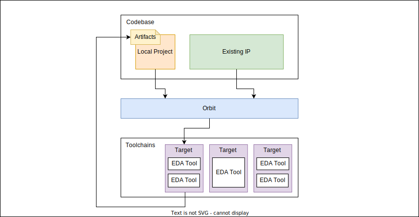

# Orbit

[](https://github.com/chaseruskin/orbit/actions) 
[](https://chaseruskin.github.io/orbit) 
[](https://www.gnu.org/licenses/gpl-3.0) 
[](https://hub.docker.com/repository/docker/chaseruskin/orbit/general) 
[](https://github.com/chaseruskin/orbit/releases)

Orbit is an agile package manager and extensible build tool for hardware description languages (HDL).


Orbit's system introduces a layer of abstraction called __IPs__, which groups related source code files (`.v`, `.sv`, `.vhd`) together within a common directory. See [Overview](https://chaseruskin.github.io/orbit/topic/overview.html) for more details describing Orbit's system architecture.

### Live at the cutting edge of hardware design

The boom of AI and emerging workloads have shown just how fast new advancements can be made in models and algorithms. Today's hardware is no longer good enough to meet the immediate demands of tomorrow's innovations; today's hardware must shift to a more agile development approach. It's time to build tomorrow's hardware, today. It's time to __live at the cutting edge of hardware design.__

### An agile package manager designed to minimize technical debt 

As codebases scale and increase in complexity, it becomes of upmost importance to have the right system in place to efficiently manage the increasing number of resources. Without the right system, the codebase can become bogged down by _technical debt_, leaving you stuck in yesterday's designs.

However, using just any package management system does not guarantee that technical debt is minimized. Poorly-designed package managers will simply shift the technical debt to different resources, while a well-designed package manager will minimize the overall amount of technical debt. With minimal technical debt, you can bring up tomorrow's hardware today. Orbit is __an agile package manager designed to minimize technical debt.__

### An extensible build tool designed to support any workflow

Hardware development involves many complex processes, from running simulations to generating bitstreams. Orbit simplifies the build process into two stages: planning and execution. Orbit performs the planning of a build by resolving all HDL source code dependencies to produce a single file listing the topologically sorted source file order. From here, Orbit invokes any user-configured target to execute and process the planned list of source files. By allowing users to add their own execution processes, Orbit is __an extensible build tool designed to support any workflow.__

### Free and open source

Orbit is available free to use and open source to encourage adoption, contribution, and integration among the hardware community. We rely on the open source community for feedback and new ideas, while remaining focused on our design goals and principles.

Orbit's use case is targeted toward anyone interested in developing digital hardware; this includes industrial, academic, and personal settings. Create your next commerical product, university lab assignment, or personal project, using a tool that is tailored to today's advanced development processes.

Prebuilt binaries are available for Linux, MacOS, and Windows with no dependencies. Visit the [releases page](https://github.com/chaseruskin/orbit/releases) for the latest version. Working on a different platform? No problem, building from source is easy with [Cargo](https://doc.rust-lang.org/cargo/getting-started/installation.html), Rust's default package manager. Use docker? We have [docker images](https://hub.docker.com/repository/docker/chaseruskin/orbit/general) available too. See [Installing](https://chaseruskin.github.io/orbit/starting/installing.html) for complete details.

For more information on getting started and how to use Orbit in your workflow, check out the [Book of Orbit](https://chaseruskin.github.io/orbit/).

## The Missing Layer of Abstraction

Orbit operates at the layer between your codebase (source code files) and your toolchains (custom EDA workflows). Without Orbit, codebases had to directly interface with EDA tools, often resulting in hard to maintain scripts and noninteroperable workflows across tools and projects.



With Orbit, a key layer of abstraction is introduced to manage your codebase within your filesystem as well as interface with your required toolchains. The interface between Orbit and your codebase is linked through adding a simple manifest file to your projects. The interface between Orbit and your toolchains only requires users to write a lightweight script called a _target_ that wraps your existing EDA tools into a defined workflow.

## Simple and intuitive to use

Orbit manages your project by turning it into a package (referred to as an ip) with the addition of two files: "Orbit.toml" and "Orbit.lock".

```
cpu/
├─ Orbit.lock
├─ Orbit.toml
├─ rtl/
│  ├─ ctrl.vhd
│  ├─ datapath.v
│  └─ top.vhd
└─ sim/
   └─ top_tb.sv
```

The "Orbit.toml" file is a simple TOML file maintained by the user that requires only a couple fields, such as the ip's `name` and `version`, to get setup.

Filename: Orbit.toml
``` toml
[ip]
name = "cpu"
uuid = "71vs0nyo7lqjji6p6uzfviaoi"
version = "1.0.0"

[dependencies]
gates = "2.0.0"
```

The "Orbit.lock" file is a detailed TOML file automatically maintained by Orbit that stores the complete list of resolved dependencies, including how to get them. This allows anyone to rebuild your project with the exact source code you had as well, even if the source code is distributed across repositories.


## Low effort integration

To encourage code reuse and faster development cycles, Orbit includes HDL-specific commands to integrate designs across ips. For example, Orbit can display HDL code snippets of existing design units to be instantiated within your local ip.

This includes support for VHDL source code:
```
$ orbit get and_gate --ip gates:2.0.0 --library --signals --instance
```
``` vhdl
library gates;

signal a : std_logic;
signal b : std_logic;
signal x : std_logic;

u_and_gate : entity gates.and_gate
  port map(
    a => a,
    b => b,
    x => x
  );
```

As well as support for Verilog/SystemVerilog source code:
```
$ orbit get or_gate --ip gates:2.0.0 --signals --instance
```
``` systemverilog
logic a;
logic b;
logic x;

or_gate u_or_gate (
  .a(a),
  .b(b),
  .x(x)
);
```

## Flexibility in use

Since Orbit focuses on efficiently managing the HDL source code and minimizing its associated technical debt, users have the power to add their own execution targets to the build process. This is accomplished by Orbit performing the planning of a build process to generate a single file, called a blueprint, that lists the topologically-sorted order of source files. After planning the build, Orbit invokes the user's target to perform the execution process on the list of source files.

Filename: blueprint.tsv
```
VHDL	gates	/users/chase/.orbit/cache/1pgjtja7i1rcf0i5-2.0.0/rtl/nand_gate.vhd
VHDL	gates	/users/chase/.orbit/cache/1pgjtja7i1rcf0i5-2.0.0/rtl/and_gate.vhd
VLOG	cpu	/users/chase/projects/cpu/rtl/datapath.v
VHDL	cpu	/users/chase/projects/cpu/rtl/ctrl.vhd
VHDL	cpu	/users/chase/projects/cpu/rtl/top.vhd
SYSV	cpu	/users/chase/projects/cpu/sim/top_tb.sv
```

Add a target by writing a script that reads Orbit's generated blueprint file for whatever EDA tools you prefer, and use it across all future ips.  

## Highlights

What makes Orbit an agile package manager for HDLs? Here are some of its key features:

- Orbit acts as the intermediary between your source code and backend EDA tools, automating the upkeep process and minimizing technical debt as your codebase evolves over time

- Overcome namespace collisions, a problem inherent to VHDL and Verilog/SystemVerilog, with Orbit's novel algorithm that dynamically transforms conflicting design names called [_dynamic symbol transformation_](https://chaseruskin.github.io/orbit/topic/dst.html)

- By performing dynamic symbol transformation, multiple versions of the same design unit (or more broadly, design units given the same identifier) are allowed in the same build under [two simple constraints](https://chaseruskin.github.io/orbit/topic/dst.html#limitations)

- No longer worry about manually organizing a design unit's order of dependencies with Orbit's built-in ability to tokenize HDL source code and automatically identify valid references to other design units

- Reproduce results across any environment with Orbit through its automatic handling of lockfiles and checksums

- Supports VHDL, Verilog, and SystemVerilog hardware description languages

- Quickly navigate through HDL source code to read its inline documentation and review a design unit's implementation with Orbit's ability to jump to and display HDL code segments

- Integrate existing design units across projects faster than ever with Orbit's ability to display valid HDL code snippets for design unit instantiation

- Explore your evolving codebase to identify the projects you need next with Orbit's ability to quickly search through known ip by filtering based on keywords, status, and name

- Keep your source code independent of vendor tools and avoid vendor lock-in with Orbit's vendor-agnostic interface to backend EDA tools

- Continue to use your preferred version control system (or none) due to Orbit's flexible approach to being version control system agnostic

- Review high-level design unit circuit tree hierarchies at the HDL level or ip level

- Linux, MacOS, and Windows are fully supported with zero additional dependencies

- Docker images and GitHub Actions are available to support CI/CD workflows

- Manifest files that mark a project as an ip only require a few user-defined fields to get setup

- Write a target for your preferred EDA tools once, and reuse across projects with Orbit's support for configuration files

And these are only a few of Orbit's features! Download Orbit and read its documentation today to discover everything Orbit provides as an agile package manager for HDLs. 

## Installing

Orbit has prebuilt binaries for MacOS, Windows, and Linux. See the [releases page](https://github.com/chaseruskin/orbit/releases) to download the latest version, or build from source using [Cargo](https://doc.rust-lang.org/cargo/getting-started/installation.html), Rust's default package manager. See [Installing](https://chaseruskin.github.io/orbit/starting/installing.html) for more details on getting Orbit up and running.

## Documentation

Read the [Book of Orbit](https://chaseruskin.github.io/orbit/) for comprehensive documentation composed of tutorials, user guides, topic guides, references, and command manuals.

Orbit brings an agile approach to hardware development that minimizes technical debt through its available commands related to ip integration and build automation:
```
Orbit is an hdl package manager and build tool.

Usage:
    orbit [options] [command]

Commands:
    new                   create a new ip
    init                  initialize an ip from an existing project
    info                  display information about an ip
    read                  lookup hdl source code
    get                   fetch an hdl unit for code integration
    tree                  show the dependency graph
    lock                  save the world state of an ip
    test, t               run a test
    build, b              plan and execute a target
    publish               post an ip to a channel
    search                browse the ip catalog
    install               store an immutable reference to an ip
    remove                delete an ip from the catalog
    env                   print orbit environment information
    config                modify configuration data

Options:
    --version             print version information and exit
    --upgrade             check for the latest orbit binary
    --license             print license information and exit
    --sync                synchronize configured channels
    --force               bypass interactive prompts
    --color <when>        coloring: auto, always, never
    --help, -h            print help information

Use 'orbit help <command>' for more information about a command.
```

## License

This program is free software distributed under the terms of the GNU General Public License version 3 or later. You may use, modify, and redistribute the program as you wish but if you distribute modifications you must preserve the license text and copyright notices, and also make the modified source code available to your users. 

See [LICENSE](./LICENSE).

## Sponsoring

If you find this tool useful, please consider sponsoring! This project started got its inspiration from my first internship with NASA Glenn Research Center in 2021, and I have started working on this project in my spare time throughout my undergraduate and graduate studies since then. Any donation amount is greatly appreciated.

## Contributing

See [CONTRIBUTING](./CONTRIBUTING.md).
